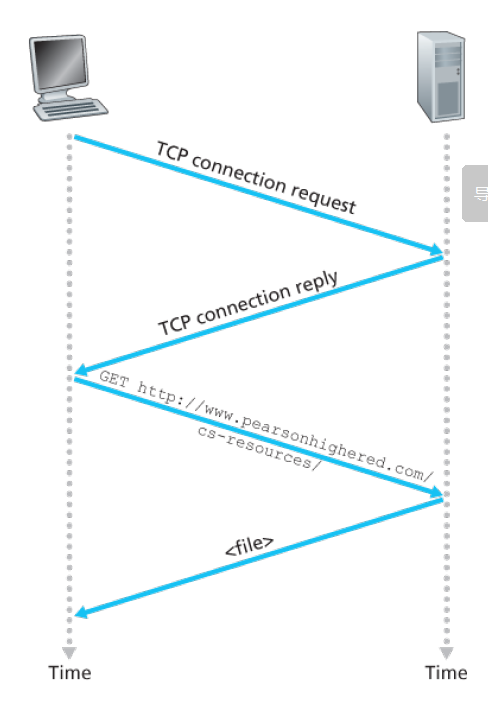

# 第一章 计算机网络和因特网

1. delay延时、loss丢包、throughput吞吐量；

## 1.1 What is the Internet

1. 因特网由基本硬件和软件组成（hardware and software）
2. distributed applications services 分布式应用服务。根据为分布式应用提供服务的联网基础设施来描述因特网。

### 1.1.1 具体构成概述

1. 连接互联网的设备分为host和end system，主机和终端。
2. host分为两类：clients客户和servers服务器。
3. 终端end systems通过communication links通信链路 和packet switches分组交换器连接到一起。
4. 通信链路有不同的物理媒介（铜、光纤电缆等），传输速率transmission rate不同，单位bits/s。
5. 传输的时候数据被分段并加上头字节header bytes===》形成packets 分组来传输。
6. **packets switch**一端接收packet分组，另一端转发该分组。
7. 常见的packets switch 分组交换器形式：  

   (1). router路由器，通常用于network core网络核心（核心网主要作用是实现信息的交换和传送、各种业务网）；

   (2). link-layer switch 链路层交换机，通常用于access networks 接入网（接入网承上启下，把核心网的业务提供给用户）中。

1. 从发送端系统到接收端系统，一个分组所经历的一系列通信链路和分组交换机被称为通过该网络的路径。==》路径是由路由协议控制
2. 分组==》卡车
   通信链路==》高速公路
   数据==》货物
   分组交换机==》交叉口
   端系统==》目的地仓库

3. 端系统通过Interner Service Providers，ISPs因特网服务提供者接入互联网；每个ISP本身就是由多个分组交换器packet switches和多个通信链路communication links组成的网络。

4. 端系统、分组交换器和互联网的其他组成都要运行**协议**protocols。主要协议统称为TCP/IP协议。

5. **TCP Transmission Control Protocal 传输控制协议；IP Internet Protocol 网际协议，定义了packet的格式**；

6. 这些协议定义在Request For Comment RFC 文档中，请求评论。

### 1.1.2 对于service的描述

1. 分布式应用程序distributed application：就是在多个端系统上有的，并且这些端系统会通过应用程序交换数据。
2. 如何让不同端系统之间的应用程序能够正确的传输数据：socket interface**套接字接口**。socket interface规定了一个端系统上的程序跟另一个端系统上的程序交付数据的方式。===》**是通过互联网发送数据必须遵守的一系列规则的集合**。
    就像邮局发邮件要按照邮局的规定贴邮票、写地址和邮编。

### 1.1.3 什么是协议 protocol

1. 协议定义了两个或者多个通信实体之间**报文交换的顺序和格式**，以及报文发送和、或接受一条报文或其他事件所采取的**动作**。

## 1.2 The Network Edge 网络边缘==》就是端系统和主机，因为他们在网络边缘

1. 其他概念（不重要）The Internet of Things 物联网

### 1.2.1 Access Networks 接入网

1. 接入网：把端系统物理连接到边缘路由器（edge router）的网络。
2. edge router是端系统连接到其他任何远程端系统的路径上的第一台路由器。
3. 接入网的类型：  
    （1）家庭接入：DSL、电缆、拨号、光纤、卫星；

    （2）企业/S家庭接入：局域网（local area network LAN）接入。包括ethernet以太网（以太网使用了双铰铜线）和WIFI。

    （3）Wide-Area Wireless Access 广域无线网接入：cellular network蜂窝网络和Long-Term-Evolution LTE。
4. modem 调制解调器，**猫**工作在物理层和数据链路层的交界处，**主要用于信号转换，把光纤信号/电话线信号转化为计算机可识别的数字信号**。和上文中网络边缘的链路层交换器不是一个东西，链路层交交换器的作用也还是转发数据。

### 1.2.2 Physical Media 接入网的物理媒介

1. 分类：  
   guided media 导引型媒体，带线的固体媒介

   unguided media 非导引型媒体，WIFI在空气中传播。
2. 具体：  
   （1）双绞铜线 Twisted-Pair Copper Wire。 Unshielded Twiste Pair UTP 无屏蔽**双绞铜线常用于LAN 局域网中、以太网。**  
   （2）同轴电缆 Coaxial Cable，两个同心铜导体组成。  
   （3）光纤 Fiber Optics。引导光脉冲pulses of light，每个脉冲表示一个比特。  
   （4）陆地无线电信道 Terrestrial Radio Channels。不需要物理线路，有损耗  
   （5）卫星无线电信道 Satellite Radio Channels。地面发射给卫星，卫星转发给另一个地面接收器。

## 1.3 网络核心 The Network Core

通过网络链路和交换机传输数据的两种方法：

   (1). 分组交换packet switching

   (2). 电路交换 circuit switching。

### 1.3.1 Packet Switching 分组交换

1. 分组的大小L bit，链路传输速率R bit/s,传输分组的时间L/R

#### 一、Store-and-Forward Transmission 存储转发传输  

**分组交换器必须收到整个分组之后才能开始转发，在收到整个分组之前要把已经收到的bit存储下来**。

所以上图从源到目的地的时间是L/R+L/R=2L/R。如果不需要存储转发的话时间就是L/R，但是都需要啊。  
传输三个分组需要的时间（路由器把上一个分组转发给目的地的同时，正在接受下一个分组）是4L/R。

1. N段路径、N-1个路由器，每段路径传输速率为R，则端对端的传输时延是d=NL/R.
2. N段路径、N-1个路由器，每段路径传输速率为R，传输P个分组的总传输时延是d=PL/R+(N-1)L/R。只需要算最后一个分组被传输到第一个路由器时已经用了多少时间，加上最后一个分组从第一个路由器被传输到目的地的时间，因为之前的分组肯定都已经到达了。

#### 二、Queuing Delays and Packet Loss 排队延时和分组丢失

1. 连接了多个链路的分组交换机有一个输出缓存output buffer/输出队列output queue;**因此分组还要承受输出缓存造成的排队延时queuing delay。**
2. 输出缓存满了会发生丢包packet loss。

#### 三、Forwarding Tables and Routing Protocols 转发表和路由选择协议==》路由器怎么决定要把分组发往哪条链路？

1. 每个端系统有一个IP地址==》源在分组packet的header中包含了目的地的IP地址。
2. 路由器收到packet之后检查目的地址，**根据目的地址搜索自己的forward table转发表，查找到对应的output link**，就知道要把分组发往哪里了。
3. 转发表是怎么设置的？==》由routing protocol 路由选择协议自动设置。

### 1.3.2 电路交换 circuit switching

1. 电路交换中，在端系统的通信会话期间，预留了沿路径通信所需要的资源（缓存、链路传输速率等）。===》如传统电话网络，两台电话之间的线路已经接好了端到端连接end-to-end connection；但是如图两条交换机之间传输总速率1Mbps，搭建了4条电路，使用的时候就是250kbps。
 
1. 分组交换系统中不预留，所以出现排队延时，但是用的时候带宽是共享的。

#### 一、电路交换网络中的复用 Multiplexing in Circuit-switched Networks

1. 分为Frequency-Division Multiplexing，FDM 频分复用 和 Time-Division Multiplexing，TDM时分复用。

2. FDM。每个连接有自己的专用频段，频段宽度就是 band-width带宽。
3. 上图中TDM，把时间分为若干frame帧，再把frame帧分为固定数量的time slots时间间隙，每个固定的时间间隙指定每个连接单独使用。
4. 电路交换的静默期silent period指的是连接了电路但是没在使用，比如电话打通了但是没人说话,期间资源也不能给别人使用==》分组交换支持者觉得不够经济。

#### 对比分组交换和电路交换

1. 分组交换不适合视频、电话等实时服务，因为端到端延时不可预测。
2. 分组交换是共享带宽的。能容纳更多用户。
3. 并发的simultaneous

### 1.3.3 A Network of Networks 网络的网络

1. 前面讨论的让端系统连接到ISP Internet Service Provider只是网络的一小部分，ISP们本身必须互相连接==>需要creating a network of networks

2. **低等级的ISP**接入高等级的ISP**需要向高等级的ISP付费**，所以低级的是customer，高级的是provider。每个登记都有多个ISPs相互竞争。
3. 较高层ISP彼此互联。global transit ISPs之间要相互连接，以实现联网。==》**ISP的等级两方一样的时候，两者都不需要付费结算，称之为对等peer**。

4. 上图是当前互联网的结构图。谷歌这种内容提供商搭建自己的网络（content provider network）可以与底层ISP直接连接，也连接高层ISP。
5. IXP 是Internet exchange point互联网交换点，多个ISP可以在这里对等peer。

## 1.4 Delay,Loss, and Throughput in Packet-Switched Networks 分组交换网络中的时延、丢包和吞吐量

1. 端系统之间的吞吐量：每秒可以传输的数据量

### 1.4.1 Delay 分组交换网络中的时延概述

1. 节点总时延total nodal delay = 节点处理时延nodal processing delay + 排队时延 queuing delay + **传输时延transmission delay** + **传播时延propagation delay**。

   (1) nodal processing delay 比如路由器检查分组的header，查找forwarding table决定把该分组转发到哪一条链路上。

   (2) queuing delay 前面有没有别的packet在排队。

   (3) transmission delay ==>L/R 分组长度/传输速率，**是把所有分组的比特推向链路需要的时间**。

   (4) propagation delay **走过一段链路所需要的时间** 两台路由器之间的距离d除以传播速率s==》d/s

### 1.4.2 Queuing Delay and Packet Loss 排队时延和丢包

1. 前面的分组排队时延可能小，后面的多==》用统计量来度量排队时延
2. **流量强度traffic intensity L*a/R。** L是每个分组的比特大小，a是分组到达队列的平均速率，单位分组/秒，R是传输速率===》La/R是比特到达队列的平均速率。 **La/R >1 ==>队列无线增加，排队时延趋向于无穷大。**

3. 通常到达队列的**过程是随机**的，分组之间的时间间隔是随机的。
4. 队列满了，排队缓存满了，路由器会丢弃drop分组，造成packet loss===》流量强度越大，丢包概率越大。
5. 后面可能会讲 基于端到端的原则把lost packet重传。

### 1.4.3 端到端时延

1. nodal delay是单台路由器上的时延，端到端之间有N台路由器，端到端延时D(end-end) = N(dprocessing + dtransmission + dpropagation),假设排队时延是0。
2. 端系统的其他重要时延。如语音应用的媒体分组化时延media packetization delay==》传递分组之前要先把数字化语音编码、填充到分组中。

### 1.4.4 Throughput in Computer Networks 计算机网络中的吞吐量

1. 瞬时吞吐量instantaneous throughput 电脑下载文件的速率

2. 从服务端向客户端传输文件的吞吐量是 R1到Rn中最小的值。瓶颈链路 bottleneck link。
3. 吞吐量通常取决于接入网，因为网络核心的配置很高，一般都高于接入网的速率。
4. 没有干扰流量时，**吞吐量**近似为**从源到目的地的路径的最小传输速率**。

## 1.5 Protocol Layers and Their Service Models 协议层次及其服务模型

### 1.5.1 Layered Architecture 分层的体系结构

#### Protocol Layering协议分层

1. 分层服务的概念service model of a layer：通过在当前层执行某些动作或者直接**使用下层的服务来实现当前层的服务**。
2. 网络分层通常是硬件hardware和软件software的混合组成。
3. 协议分层有概念化和结构化的优点 Protocol layering has conceptual and structural advantages。
4. 协议分层的缺点：

   (1). 一个分层可能会和低层的功能重复；

   (2). 一个分层的功能需要的信息可能只能在另一个分层中找到===》违背了分层的目标。
5. 各层的所有协议被称为protocol stack协议栈。
6. 下图是自顶向下方法介绍 top-down approach，从应用层开始：  
   **5层因特网协议栈** five-layer Internet protocol stack  

   Application ....... 应用层 HTTP协议(TCP连接)、DNS协议(UDP连接)  
   Transport ........... 运输层 TCP和UDP协议  
   Network ............. 网络层 IP协议、路由选择协议  
   Link ...................... 链路层  
   Physical .............. 物理层  
   ——————

   7层ISO OSI参考模型 Seven-layer ISO OSI reference model  
   OSI Open Systems Interconnection model 开放系统互连模型  

   Application ........ 应用层  
   Presentation ..... 表示层  
   Session ............... 会话层  
   Transport ........... 运输层  
   Network ............. 网络层  
   Link ...................... 链路层  
   Physical .............. 物理层

#### Application Layer 应用层

1. 应用层的信息分组（packet of information）被称为**message报文**。
2. 应用层有很多协议 HTTP protocol（web文件的请求和传输）、SMTP（e-mail）、FTP（端之间的files 传输）、DNS domain name system（DNS也是应用层的协议，把IP地址转化为友好的域名）。
3. 应用层协议定义了**不同端系统上的应用程序进程如何相互传递报文**。

#### 表示层和会话层

1. 使应用程序能够解释交换数据的含义，提供数据压缩、加密和数据描述（解决应用程序在不同计算机之间存储、表现数据的格式不同的问题）服务。
2. 会话层提供数据交换的定界和同步功能，如建立检查点和恢复方案的方法。
3. **因特网中没有表示层和会话层**，如果应用程序开发者觉得需要可以自行解决去在程序中添加这两个功能。

#### Transport Layer 运输层

1. 运输层用来**在应用程序的端点之间传输**应用层的报文。==》**运输层的分组被称为segment报文段。**
2. 运输层协议有两个：  

      (1) TCP，提供面向连接的服务connection-oriented service==》**提供可靠的、可流量控制**的传输服务，将长报文划分成短报文，并提供**拥塞控制**机制。需要维护连接状态。

      (2) UDP，提供无连接服务connectionless service，可靠性、流量控制、拥塞控制都没有。是无状态的。

#### Network Layer 网络层==》简称为IP层

1. 网络层的分组被称为**datagrams数据报**。
2. 网络层负责将datagrams数据报从一台主机移动到另一台上，即**端系统到端系统之间**。
3. 运输层的协议把运输层的报文段和目的地地址递交给网络层。
4. 网络层的协议：  
   （1）网际协议IP（定义了数据包datagrams中的字段以及端系统和路由器如何作用这些字段），所有网络层的因特网组件必须运行IP协议。  
   （2）路由选择协议routing protocol==》决定datagrams数据报从源到目的地要经过哪些路由。

#### Link Layer 链路层

1. 网络层把数据报从一个节点移动到下一个节点，节点和节点之间要依赖链路层的服务。网络层（路由）==》数据报从网络层下传给链路层==》链路层把数据报上传给网络层==》到达下一个节点路由。
2. 运输层协议如TCP是从一个端系统到另一个端系统。中间经过很多路由节点，链路层是**从一个路由节点到另一个路由节点**。
3. link-layer packets 链路层分组被称为帧frames。

#### Physical Layer 物理层

1. 物理层是把frames中的**一个个比特**individual bits**从一个节点移动到另一个节点**。
2. 物理层协议还是和链路相关，且与链路的物理媒体有关，如双绞铜线还是光纤。

### 1.5.2 Encapsulation 封装

1. 链路层交换机只实现了前两层（能识别链路层地址如以太网地址），路由实现了前三层、有IP。
2. 每一层都会把上一层传过来的分组作为**有效载荷字段payload field**，加上自身的首部字段，形成自己的分组传给下一层。
3. **应用层报文 message + 运输层header首部 ===》运输层报文段segment + 网络层header包含源和目的地端系统地址信息 ===》网络层数据报datagrams + 链路层header ==》链路层帧frame。**

## 1.6 Networks Under Attack

1. 恶意软件 melware===》很多受害设备的网络被统称为僵尸网络botnet。
2. melware多是自我复制的self-replicating。以病毒virus或蠕虫worm形式扩散。**病毒需要用户交互，蠕虫无需任何用户交互就能进入设备。**
3. Denial-of-Service attack, DoS拒绝服务攻击。让服务器不能再正常提供服务，如想办法让服务器的接入链路拥堵。
4. Distributed DoS，DDoS分布式DoS，用多个源向目标发起猛烈攻击。
5. 分组嗅探器packet sniffer 被动接收、记录附近流经的packet，窃取数据，不易被发现。
6. IP spoofing 冒充受到信任的用户==》端点鉴别 end-point authentication。
