# 第三章 运输层

1. **运输层**位于应用层和网络层之间，**给不同主机上的进程提供逻辑通信**而不是物理通信==》不需要考虑物理基础设施。
2. **网络层提供不同主机之间的逻辑通信**。

## 3.1 概述和运输层服务 introduction and transport-layer services

1. 运输层把进程发送的报文划分成小段，加上运输层header组成**运输层报文段segment**。
2. **运输层协议只在端系统中工作**，网络路由器只作用于网络层字段，不检查里面的运输层字段。==》**运输层不管具体网络中如何传递**，只负责接到网络层报文后分发给正确的进程。

### 3.1.1 运输层和网络层的关系 relationship between transport and network layers

1. 网络层协议就是邮局，把这个家庭所有邮件分发到位（对应网络层提供主机之间的逻辑通信），每个家庭有一个人如Ann和Bill负责把自己家的邮件给到具体的人头（主机上的进程），Ann和Bill就是运输层协议
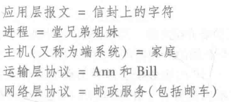
2. 邮局不能按时送到那么Ann和Bill也不能完成分发邮件的任务==》**运输层协议能提供的服务往往受制于底层网络层协议的服务模型**。

### 网络层简介

1. 网络层的IP协议/网际协议，是**尽力而为交付服务best-effort delivery service**==》尽最大努力在主机之间提供逻辑通信，但是**不做任何确保**==》不保证报文段的交付，不保证报文段的按序交付，不保证数据完整性==》**IP是不可靠服务unreliable service**。

### 3.1.2 因特网运输层概述 Overview of the transport layer in the Internet

1. 最基础的运输层服务==》UDP仅能提供这两种服务：

      (1). 进程到进程的数据交付;

      (2). 通过**检验和对运输层报文段进行差错检**，但是UDP只能检测差错不能恢复差错。

## 3.2 Multiplexing and Demultiplexing 把主机间的交付扩展到进程间的交付被称为多路复用和多路分解

1. **一个进程有一个或多个套接字socket，每个线程对应一个套接字**，每个套接字有唯一的标识符identifier。
2. 将运输层报文段中的数据交付到正确的套接字，称为多路分解。
3. 在源主机中从不同套接字中收集数据块，并为每个数据块封装上header首部信息（里面有用于以后分解的、交付给哪个套接字的信息）生成报文段，然后把报文段传递给网络层，以上工作称为多路复用。
4. 运输层报文段的首部中有特殊字段用来指定要交给哪个套接字：源端口号字段source port number field，目的端口号字段destination port number field==》这样就知道是给哪个进程了，但是TCP中的多路复用和分解更加复杂。
5. 如果编写的程序实现的是一个“周知协议”的服务器端，开发者就必须为其分配一个相应的周知端口号。
6. **网络层把数据传递给正确的主机 ==> 运输层把数据分发给正确的进程 ==> 一个进程有多个线程对应多个套接字，把报文段中的数据交付给正确的套接字称为多路分解。多路复用就是收集套接字生成报文段的反向过程。**

### 无连接的多路复用和多路分解 connectionless multiplexing and demultiplexing==》UDP

1. UDP中的运输层报文段包含：应用程序数据、源端口号、目的端口号、其他两个值；网络层把报文段封装到一个IP数据报中==》给目的主机，目的主机根据报文段中的目的端口号匹配要给哪个套接字。
2. 一个UDP套接字由一个二元组标识，包含目的IP、目的端口号==》不同源，目的地相同会定向到同一个UDP套接字。
3. 运输层报文段中的源端口号是给目的主机回发报文时用的。

### 面向连接的多路复用与多路分解 connection-oriented multiplexing and demultiplexing==》TCP

1. TCP套接字是由一个四元组（源IP地址、源端口号、目的IP、目的端口号）来标识。==》四个值都相同，即源和目的地都相同才会定向到同一个TCP套接字。==》客户端初始创建连接请求，是定向给服务端的welcome socket的，welcome socket只需要目的IP、目的端口号就可以标识。

### 端口扫描 port scanning

1. port scanners端口扫面器，如nmap程序，运行nmap的主机能尝试扫描因特网中任何地方的目的主机。

### Web服务器与TCP

1. **传统服务器**为每个新的连接创建一个新的进程，**每个连接套接字与进程一一对应**。
2. **现代高性能服务器通常只是用一个进程**，所有报文段的目的端口都是80（一般设置为80），**处理并发连接是通过：为每个新的连接创建一个有新连接套接字的新线程**。
3. 持续HTTP连接，在连接期间，客户端和服务器通过同一个服务器socket交换HTTP报文；非持续HTTP连接，每一对请求/响应都创建一个新TCP连接，配合新的套接字，用完关闭。

## 3.3 无连接运输connectionless transport：UDP

1. UDP没有握手==》无连接的。
2. DNS通常使用UDP作为运输协议，如果没有等到响应就换一个服务器或者通知调用DNS服务的应用程序没收到响应。
3. UDP的优点：

      (1). 实时应用==》TCP的拥塞控制机制可能会导致延迟传送；

      (2). UDP是无连接的，就没有建立连接的时延；

      (3). **TCP要在端系统中维护连接状态**，包括接收和发送缓存、拥塞控制参数、序号与确认号的参数==》**UDP不需要**维护连接状态；

      (4). UDP的分组首部需要的字节小==》开销小

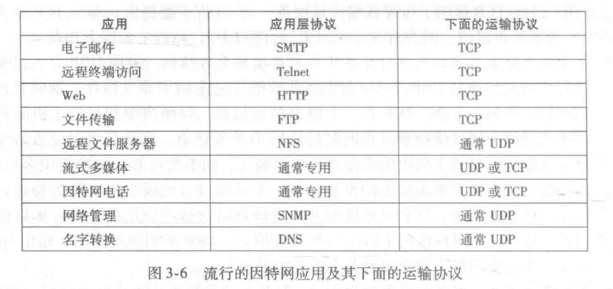

1. 隐患：每个人都用UDP开视频==》UDP中缺乏拥塞控制能够导致UDP发送方和接收方之间的高丢包率，并挤垮TCP会话。
2. **使用UDP的应用可以通过在应用程序自身中建立可靠机制来实现可靠的数据传输**。

### 3.3.1 UDP报文段结构

1. UDP首部共四个字段，每个字段两个字节：源端口号、目的端口号、长度、检验和checksum。
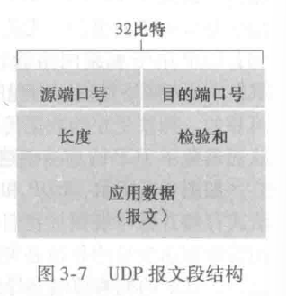
2. 接收方用检验和来检查在该报文段中是否出了差错。

### 3.3.2 UDP检验和checksum

1. 检验和是为了检查UDP报文段在从源到目的地移动时，其中的比特是否发生了变化，因为在链路传输过程中及存入路由器时可能会发生问题。
2. 检验和怎么计算：把UDP报文中的所有16位字相加，求和时的任何溢出都被回卷，然后进行反码运算。下图中是一共有三个16位字，把他们都相加。==》**接收端自己再算一遍检验和，结果如果和header中的检验和不一样就出错了**。
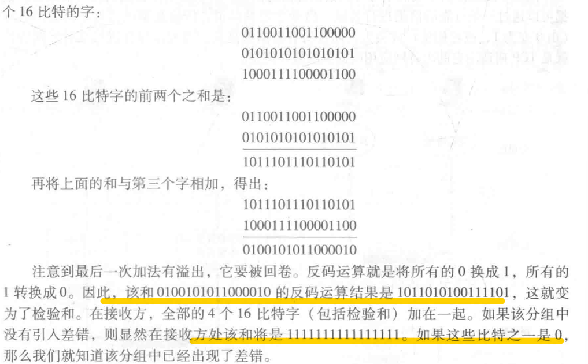
1. **UDP只能提供差错检测，不能恢复差错**。

## 3.4 可靠数据传输原理 principles of reliable data transfer==》一般性问题，不特指TCP，为TCP打基础==》本节内容主要讲 单向数据传输unidirectional data transfer，不讲双向数据传输bidirectional data transfer/全双工数据传输full-duplex service，但是协议也需要再发送端和接收端两个方向上传输分组

1. **可靠数据传输协议的下层协议也许是不可靠的，如TCP可靠，下层的IP不可靠。**
2. 端到端原则end-to-end principle：网络的核心功能应该在端点实现，而不是网络的中间节点实现。
  
### 3.4.1 构造可靠数据传输协议 building a reliable data transfer protocol==》rdt2.0和rdt3.0都是停等协议 ==>停等ARQ

#### FSM，有限状态机

1. FSM,finite state machine，有限状态机。有有限数量的状态，状态跟状态之间达到条件/发生某事件时可以切换，任意时刻状态机有且只能处在一个状态。
2. FSM中的重要概念：state状态，转移transition，动作action，event/condition事件/条件。
3. 可以给FSM中的每个状态定义接口 onEnter();onExecute();onExit()。
<https://blog.csdn.net/liqiangeastsun/article/details/118932263>
4. extended FSM，拓展FSM，模型里面引入了变量的FSM。
  
#### 可靠数据传输、信道完全可靠：rdt1.0

#### 可靠数据传输、信道有比特差错：rdt2.0

1. **自动重传请求协议automatic repeat request，ARQ**：接收者要给发送者回发肯定确认或者否定确认，如果接收者收到否定确认，就重发数据。
2. **ARQ需要差错检测、接收方反馈、重传这三种功能来处理比特差错**。
3. rdt2.0是**停等协议stop-and-wait**，发送方发送完报文后，如果等不到ACK，就不能从上层获取新数据，会把报文重发一遍。
4. 如果ACK或NAK分组受损了怎么办==》在发送方的发送的数据分组中添加**序号sequence number**字段（序号通常在0和1之间交替），反馈分组损坏的时候发送方等待不到ACK重发==》接受方根据序号知道是重发的，重发的就是冗余数据分组duplicate data packet，丢弃。

#### 可靠数据传输、信道的比特差错严重到丢包：rdt3.0

1. 发送方负责检测和恢复丢包工作：发送方使用倒计数定时器countdown timer，每发送一个分组之后启动定时器，倒计时到了但是还没收到ACK就重发分组==》**ACK丢失、分组丢失、ACK过度延时**都是可能会造成重发。
2. 序号字段一个比特大小就行，在0和1之间交替==》rdt3.0又称比特交替协议alternating-bit protocol。
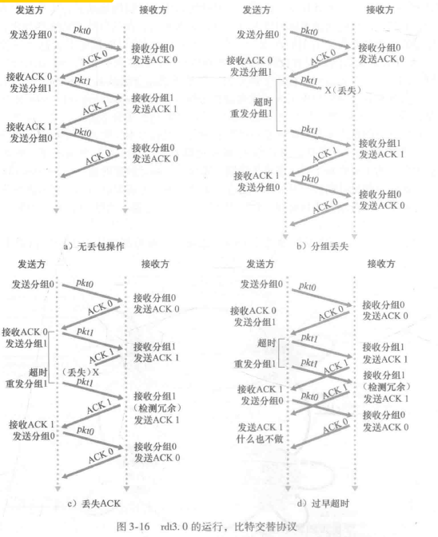
3. **总结下用到的技术：检验和、序号、定时器、肯定和否定确认分组。**

### 3.4.2 流水线可靠数据传输协议pipelined reliable data transfer protocols==》跟停等协议相对的，连续ARQ协议

1. 因为停等协议发送方的利用率很低：下图a中因为停等在RTT+L/R的时间中，发送方只在L/R这一小段时间发送了数据，（L/R）/（RTT+L/R）很小的。
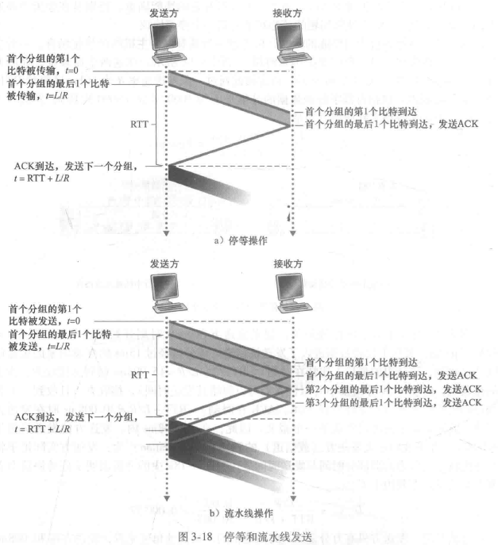
1. 流水线协议可以让发送方没收到确认报文前就**连续发送多个分组**，对应的：

      (1). 必须**增加序号的范围，要让传输中的分组都有唯一的序号**，之前只是0和1;

      (2). 发送方和接收方可能要**缓存分组**，**发送方起码要能缓存已发送但是未确认的分组**；

      (3). 上述两点的具体要求取决于如何处理丢失、损坏和延时的分组。

### 流水线协议差错恢复的两种基本方法：回退N步Go-Back-N，GBN、选择性重传selective repeat，SR

### 回退N步

1. GBN回退N步是一种滑动窗口协议sliding-window protocol，N是窗口长度window size。
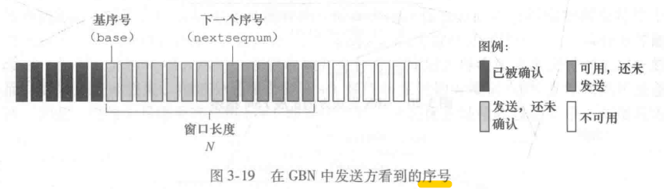
2. GBN的发送方：

      (1). 从上层接收到数据，如果窗口N满了，要么缓存数据，要么把数据返回给上层；

      (2). 可以连续发送数量<=N的未被确认的分组；

      (3). 对分组的确认采取**累积确认cumulative acknowledgment，接收到序号为n的分组的ACK，表明接收方已经正确接收到n及n以前的所有分组**；

      (4). **超时之后，重传所有已发送还没未被确认的分组**，如下图分组2超时后重传2到5所有分组；

   GBN的**接收方**：

      (5). **丢弃所有失序分组：只能按照顺序一个一个接收，顺序不对就丢弃**。
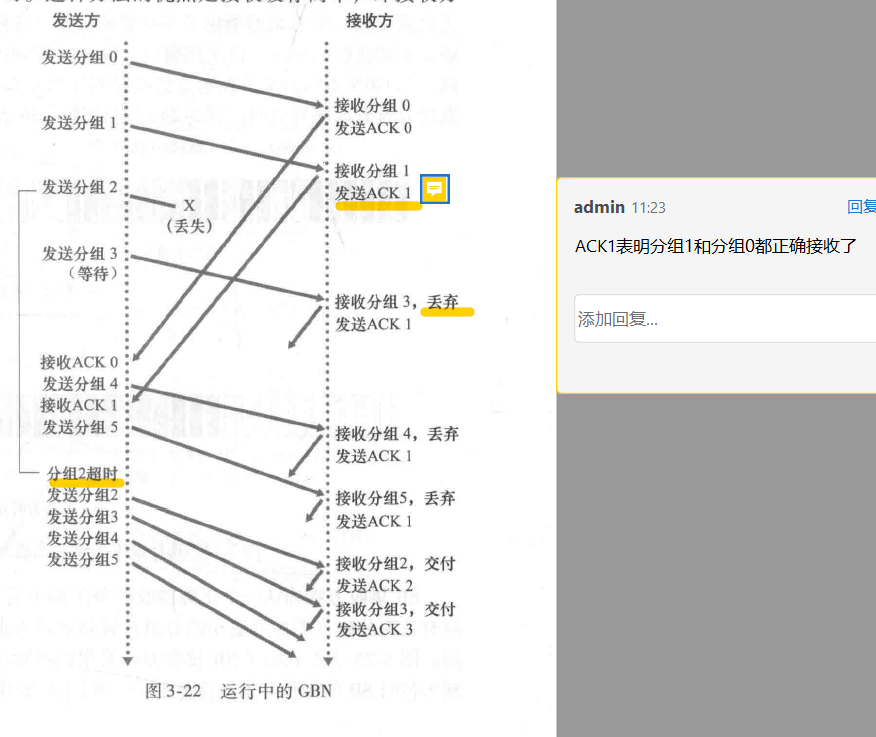

1. 缺点:一个分组错了，会引起GBN重传很多分组，尤其是窗口长度大、带宽延时大时，性能不好。==》提出选择性重传。

### 选择性重传 selective repeat，SR==》也是有窗口的

1. SR发送方：

   (1). 从上层接收数据，检查序号，如果窗口满了，缓存或者返回给上层；

   (2). 超时，定时器是对应单个分组的，超时后重发对应的那个分组；

   (3). 收到ACK后，把窗口内对应的分组标记为已接收，如果窗口开始端的分组被接收了就向前移动窗口；

   SR接收方：

   (1). 接收方逐个接收分组，不按照顺序的分组先缓存下来，知道所有按照顺序的分组都被接收了，**把这批分组按序交付给上层**。

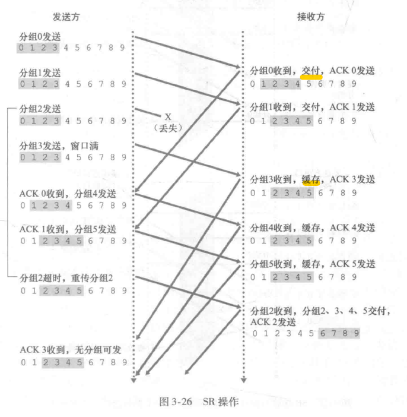

2. **SR协议中，窗口长度必须小于等于序号空间的一半**：序号空间为L，窗口长度为n，如果窗口长度太大，发送方用完所有序号（0到L-1）之后要从0开始开始用，此时发生网络延迟，接收方分不清这个0是上一轮还是这一轮序号空间的==》接收方无法按序接收了==》**要让小小的窗口在长长的序号空间上滑动才方便分清新旧分组**。

### ！！！可靠数据传输机制的总结

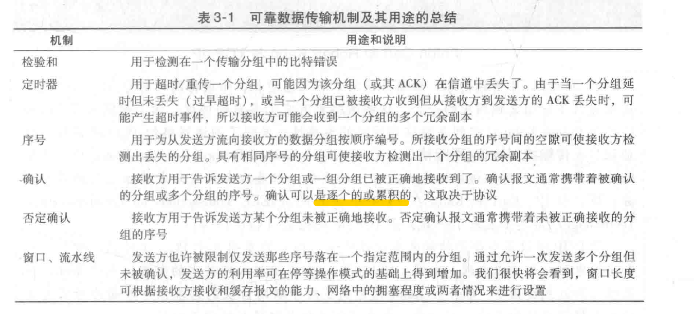

#### 自动重传请求协议， Automatic Repeat-reQuest，ARQ

1. 分 停等 和 连续 两种。

##### 停等ARQ协议

1. 就是**发送方在发送一个分组之后就停止发送**，等待接收方的ACK或者NCK，接收到ACK之后再发送下一个分组。**如果发送方没在定时器规定时间内接收到ACK，发送方就重传该分组。**
2. 重传可能因为：

   (1). 分组丢失，导致接收方没收到分组;

   (2). ACK丢失，导致发送方没收到ACK;

   (3). ACK超时 等原因。

##### 连续ARQ协议

1. 回退N步(GBN)和选择性重传(SR)

## 3.5 面向连接的运输connection-oriented transport：TCP，Transmission control protocol 传输控制协议

### 3.5.1 TCP连接 the TCP connection==》一种逻辑连接

1. TCP是面向连接的=》要先握手。
2. TCP协议只在端系统中运行，路由器和链路层交换机对他视而不见。==》端系统上的TCP程序上保存所需的状态。
3. **TCP是全双工服务full-duplex service，必须是点对点的point-to-point，不能一对多**。
4. **三次握手，前两次的报文段没有payload，第三次可以有**。
5. 客户进程把数据传递给套接字，TCP把套接字中的数据引导进发送缓存中，TCP从缓存中取出数据封装成报文段传输给接收方，接收方也有接收缓存。

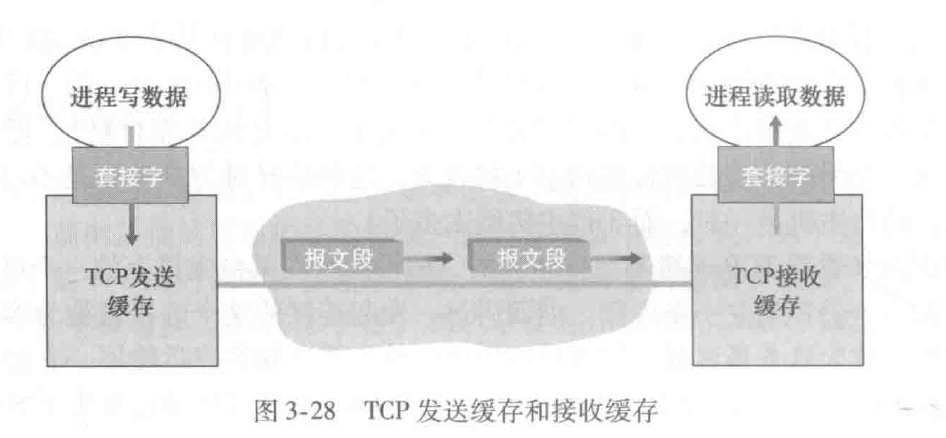

1. 最大报文段长度（只是报文段，不包含首部）Maximun segment size，MSS取决于链路层的最大传输单元Maximun Transmission Unit，MTU：
  MSS + 报文段首部大小 = MTU  
2. TCP发送文件超出MSS，就把文件分成MSS大小的若干块。
3. MTU指从源到目的地的所有链路上发送的最大链路层帧the largets link-layer frame。  
4. TCP连接的组成包括：一台主机上的缓存、变量（跟TCP连接管理相关的各种状态信息和控制参数，比如窗口大小、序号等）、跟进程连接的套接字，以及另一台主机上的另一个组缓存、变量、跟进程连接的套接字。

### 3.5.2 TCP报文段结构segment structure

1. 下图除了数据字段，其他都属于首部header字段，首部字段有：

      (1). 源端口号、目的端口号；

      (2). 序号字段和确认号字段；

      (3). 首部长度字段，由于TCP选项字段的存在，TCP首部长度是可变的；

      (4). 接收窗口字段receive window field，**用于流量控制**,告诉发送方接收方那里还有多少缓存空间可用；

      (5). 检验和字段checksum field；

      (6). 选项字段options field，用于**两端协商**最大报文段长度MSS，或再高速网络环境下用作窗口调节因子。

      (7). 6个标志字段flag field：ACK确认字段、RST\SYN\FIN用于连接建立和拆除、PSH表示接收方应立即把数据交给上层、URG报文段中有紧急数据；

      (8). 紧急数据指针字段，指出紧急数据的最后一个字节，URG和紧急数据指针都存在，TCP必须通知接收端的上层实体；
  
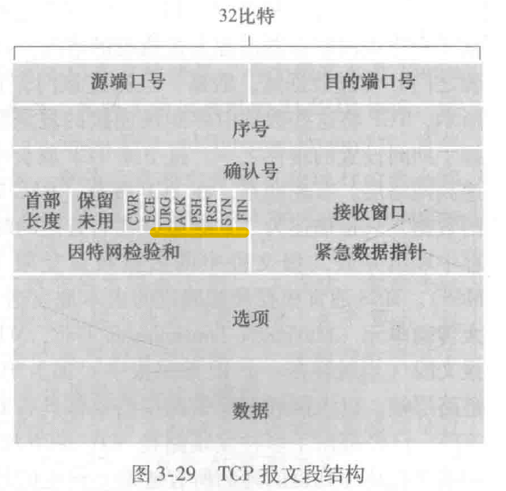

#### 序号和确认号 Sequence Numbers and Acknowledgment Numbers

1. **TCP序号是对字节流的编号，不是对报文段序列的编号**==》2000字节大小的文件，TCP对每一个字节编号，MSS是100，文件被分成20个报文段，**每个报文段的序号是该报文段的首字节的编号**, TCP随机选取首字节的编号N，因此报文段序号依次是100+N，200+N，300+N......以此类推。
2. 确认号：TCP是累积确认。确认号也是字节流编号，是接收方期待从发送方收到的有序的、不跳序的下一个字节的序号。如接收方收到了0~565字节，和900~1000字节，那么接收方回发的确认好就是566。

### 3.5.3 往返时间的估计与超时

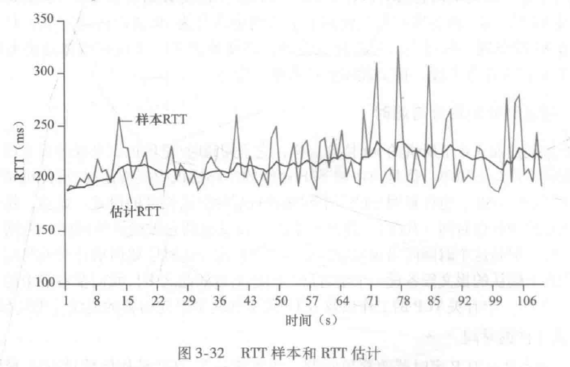

1. TCP采用超时/重传处理报文段的丢失==》超时间隔必须大于连接的往返时间RTT。

#### 估计往返时间

1. RTT是从某报文段被发出到对该报文段的确认被收到之间的时间量。
2. 指数加权移动平均来预测新的平均RTT：新的估计RTT是上一个估计RTT和最新的RTT的加权平均。

#### 设置和管理重传超时间隔

1. 
DevRTT是偏差

### 3.5.4 可靠数据传输

#### 检验和

#### 超时间隔加倍

1. 每次TCP重传时会把下一次的超时间隔改为之前的两倍==》超时可能是因为网络拥塞造成的，防止短时间内重传分组进一步造成拥塞。

#### 快速重传 fast retransmit

1. 冗余ACK，duplicate ACK，就是发送方已经收到过对同一报文段的确认了。
2. 如果接收方收到失序的报文段，报文段序号比期望收到的大==》接收方发送冗余ACK；
3. 发送方收到同一个报文段的三个冗余ACK，怀疑这之后的报文段丢失，立刻执行快速重传fast retransmit。

#### TCP是SR和GBN的结合

1. TCP不会像GBN一样n丢包了就重传n之后的所有；
2. TCP也会缓存失序报文；

### 3.5.5 流量控制 flow control, 和拥塞控制有区别

1. 发送方发送的过快，接收方的缓存溢出，**流量控制就是让发送方和接收方的速率匹配防止接收方缓存溢出**。
2. **接收方**在报文段的**接收窗口receive window字段**中传rwnd的值，告诉发送方自己还有多大的空闲缓存可用，防止缓存溢出==》rwnd是动态变化的。
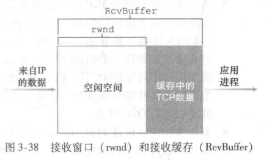
3. 当发送方收到接收方的报文中rwnd=0时，继续发送一个只有一个字节的报文段，好让接收方在缓存恢复的时候能告知自己==》不然接收方不会在没有请求、没有数据要发送的情况下发报文给发送方，发送方就一直以为接收方还在没缓存的状态下，发送方停止发报文造成阻塞。

### 3.5.6 TCP 连接管理

#### 三次握手

1. **三次握手**的报文段交换：

      (1). 第一次：客户端的TCP向服务端的TCP发送**SYN报文段**：没有payload应用层数据，SYN=1，初始序号x是客户端随机选的；客户端的TCP状态从发送前的**CLOSED变为SYN_SENT**

      (2). 第二次：**服务端收到SYN报文段后为该TCP连接分配TCP缓存**，发送允许连接的报文段**SYN-ACK报文段给客户端**：没有payload应用层数据，SYN=1,其中ACK确认号字段=x+1;SYN的初始序号y是服务端随机选的自己的初始序号。服务器状态从**LISTEN==》SYN_RCVD**；

      (3). **收到SYN-ACK报文段后，客户端也要给该连接分配缓存和变量**，发送确认SYN-ACK的确认报文段给服务端：可以携带payload数据，确认号=y+1，**SYN=0**因为连接建立。客户端从SYN_SENT状态变为**ESTABLISHED**状态;服务器状态从**SYN_RECVD==>ESTABLISHED**。

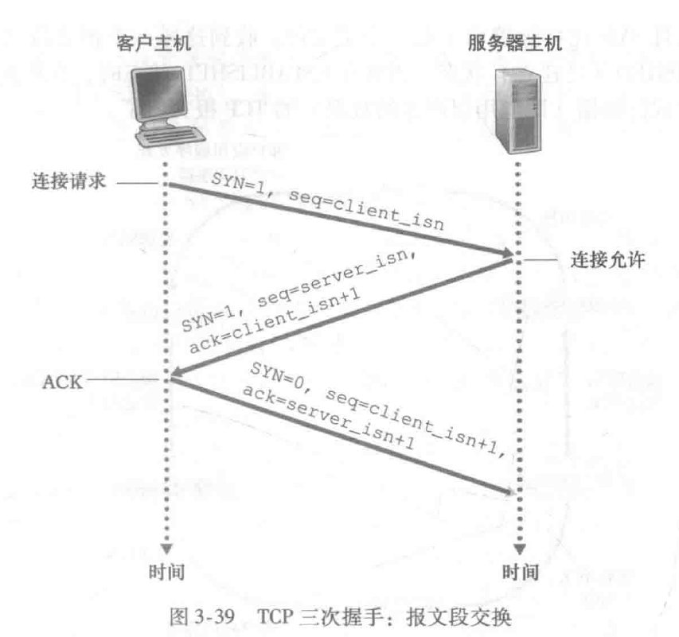

2. **完成三次握手之后在连接中的每个报文段的SYN都是0**。
3. 为什么要三次握手？目的是让客户端和服务器都确认自己和对方的发送和接受都正常（自己发送正常1，自己接受正常2，对方发送正常3，对方接受正常4）：

   (1). 第一个握手Client什么都不能确认，Server确认对方发送正常3、自己接受正常2；

   (2). 第二次握手Client确认自己发送正常1，自己接受正常2，对方发送正常3，对方接受正常4；Server确认2、3；

   (3). 第三次握手Client确认1、2、3、4，Server确认对方发送正常1、2、3、对方接受正常4。

#### 四次挥手

1. **参与一条TCP连接的两个进程中的任何一个都能终止该连接**。
2. 连接结束后，**双方释放TCP缓存和变量**。
3. **四次挥手**，假如是客户发起结束TCP连接：

      (1). 客户端发送报文段，FIN字段是1，序号字段是x。客户端状态从ESTABLISHED变为FIN_WAIT_1；

      (2). 服务器收到后发送ACK确认报文段，确认号字段是x+1；服务器状态从ESTABLISHED==>CLOSE_WAIT,客户端收到后FIN_WAIT_1变为FIN_WAIT_2；

      (3). 服务端发送一个报文段FIN=1，序号是y。服务器状态CLOSE_WAIT==>LAST_ACK；

      (4). 客户端收到后发送一个确认ACK报文段，确认号是y+1。客户端发完后FIN_WAIT_2变为TIME_WAIT，2MSL（Maximum segment lifetime）后客户端都没有再次收到FIN，说明服务端已经成功收到了第四次挥手、服务端已经关闭了，因此客服端也变为CLOSED；服务器收到报文后LAST_ACK==>CLOSED。
   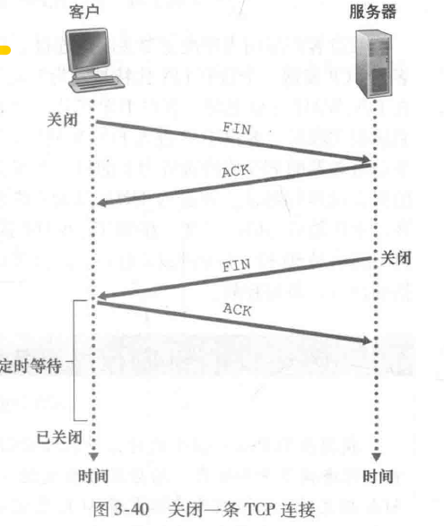

4. 为什么要四次挥手？因为TCP是全双工通信，可以双向传输数据，四次挥手是确认双方都没有数据需要再发送了。
5. 为什么第四次挥手客户端要等待2MSL时间后进入CLOSED状态？MSL是报文段最长寿命，等待2MSL就是等待一个来回（发送+收到回复）所需的最大时间。
6. 如果客户端发送一个错误的TCP连接，服务器上没开这个端口，服务器回发一个重置报文段，RST位是1，告诉客户端不要再发了。

## 3.6 拥塞控制原理 principles of congestion control==》一般性分析

### ~~3.6.1 拥塞原因与代价

1. 当分组到达的速率接近链路容量时，分组会经历巨大的排队时延。
2. 单跳路由是每个客户端通过一个固定接入点AP来访问网络；多跳路由是数据包要经过多个中间节点如路由器的转发才能到达目的地。
3. 当一个分组沿一条路径被丢弃时，每个上游路由器用于转发该分组到丢弃该分组而使用的传输容量最终被浪费掉了。

### 3.6.2 拥塞控制方法

1. 以网络层是否为运输层拥塞控制提供明确帮助来区分：

      (1). 端到端拥塞控制（TCP默认使用）：网络层没提供帮助，IP层不会向端系统提供有关网络拥塞的反馈信息。

      (2). 网络辅助的拥塞控制（最近TCP和IP能选择性的使用）：路由器向发送方提供关于网络中拥塞状态的显示反馈信息。通知的两种方法：一是路由器直接反馈给发送方，第二种是路由器在转发给接收方的分组中标记字段，接收方收到后在TCP报文中标记ECE字段（明确阻塞通告回显字段）再通知发送方。

## ** 3.7 TCP拥塞控制

### TCP拥塞控制原理

1. **发送方维护拥塞窗口congestion window，cwnd**。流量控制的接收窗口字段是rwnd，主要是接收方来维护。
2. 一个发送方中未被确认的数据量不能超过cwnd和rwnd中小的那个。

3. TCP拥塞控制，控制发送速率，让网络不拥塞又要充分利用带宽：

      (1). 丢包表示网络拥塞（超时或收到三个冗余ACK），应该减低TCP发送方的速率。

      (2). TCP发送方收到ACK后增大拥塞窗口的长度（TCP是自计时self-clocking的），即增大发送速率。

      (3). 带宽探测：不断增大速率探测拥塞的边界是哪里。

### TCO拥塞控制算法

1. 算法包括三个部分；1慢启动、2拥塞避免、3快速恢复。1和2是强制的

#### 慢启动 slow start

1. TCP连接开始时把cwnd设置为一个MSS(最大报文段长度)，对应的发送速率很小，发送方每收到一个ACK，cwnd的值就增加一个MSS==》起始很慢但是每过一个RTT就翻倍，呈指数增长。
2. 检测到网络拥塞的现象时慢启动阶段停止，发生超时指示的丢包事件时，cwnd设置为1然后后重启慢启动过程。

#### 拥塞避免 congestion avoidance

1. 拥塞避免状态时每一个RTT，增加一个MSS==》线性增长过程。发生超时指示的丢包事件时停止增长，cwnd设置为1。

#### 快速恢复状态

1. 慢启动和拥塞避免阶段，**收到三个冗余ACK之后，都会立即执行快速重传**。执行完快速重传之后进入快速恢复阶段==》**cwnd减半**，即下图的**加性增（就是拥塞避免的线性增长过程）、乘性减，AIMD,Additive-increase,multiplicative-decrease**的拥塞控制。
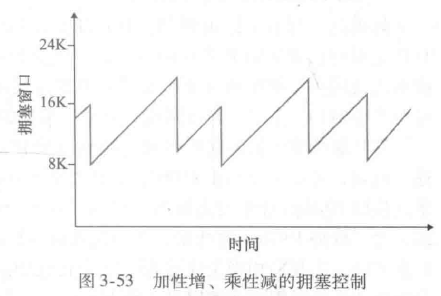

### HTTP 3.0使用基于UDP的QUIC（谷歌发明的），HTTP1.0和2.0是基于TCP的
