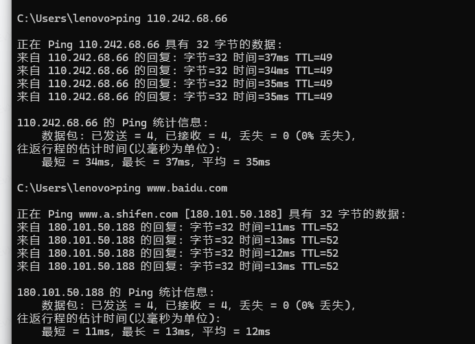

# 第二章 应用层

1. 网络应用是计算机网络存在的理由。

## 2.1 应用层协议原理 principles of network applications

1. 应用层上是在多台端系统上运行的应用程序。

### 2.1.1 网络应用程序application architecture的体系结构

1. 两种结构体系：

   (1). 客户-服务器体系结构client-server architecture
  
   (2). 对等体系结构peer-to-peer architecture。

1. client-server architecture中服务器总是打开的，服务器有固定的IP地址。**客户之间不直接通信**。使用client-server architecture的应用程序如Web、电子邮件。
2. 数据中心data center就是配备了很多hosts，来创建强大的虚拟服务器。
3. P2P体系结构中，主机即**peers之间直接通信**，对服务器依赖较小。如文件共享（BitTorrent）,peer-assisted download accelertion对等方协助下载加速器(如**迅雷**)、视频会议（如Skype）。
4. 混合结构体系==》即时通讯信息应用，服务器用来追踪IP地址，用户到用户的报文在主机之间直接发送。
5. P2P优点==》自扩展性self-scalability。**每个peer都在为系统增加服务能力**。

### 2.1.2 进程通信Processes communicating

1. **程序间通信实际上是进程在通信**。
2. 进程间通信的规则由端系统上的操作系统确定。
3. 不同端系统上的**进程**通过跨越计算机网络**交换报文message**相互**通信**。

#### 1. 客户和服务端进程client and server processes

1. 一对进程相互通信，总有一个是client角色，一个是server角色，**发起通信的进程是client，在会话开始时等待联系的进程是服务器**。包括P2P也是，一个peer是client，另一个是server。

#### 2. 进程与计算机网络之间的接口interface

1. **应用程序和网络运输层之间的接口是套接字socket==》应用程序要通过socket接口向网络发送报文/接收网络报文**。**套接字接口是进程和连接之间的门**。
2. ~~ socket又被称为应用程序编程接口application programming interface， API。
3. ~~ 应用程序开发者对socket套接字的运输层端没有控制权，选择了运输协议之后就要遵守。

#### 3. 进程寻址 addressing processes

1. 接收进程识别符 =  ip地址（表示目的地主机的地址）+ 端口号port number（接收套接字receiving socket，表示具体哪个进程接收）。
2. **当生成一个套接字时，就为它分配一个端口号**。

### 2.1.3 几种运输服务==》这是运输层的东西了

1. 选择运输服务的四个标准：  

   (1). 可靠数据传输 reliable data transfer，loss-tolerant application容忍丢失的应用；

   (2). 吞吐量 throughput，指的是每秒可以传输的数据量， 具有吞吐量要求的应用程序被称为带宽敏感的应用bandwidth-sensitive application，电子邮件等是弹性应用elastic application 对吞吐量要求不严格；

   (3). 定时 timing，指对数据交付有严格的时间限制，电话、互动游戏等交互式实时应用会要求timing；

   (4). 安全性security；

### 2.1.4 因特网提供的运输服务（新建应用程序首先就要考虑选择什么运输协议）

1. 因特网（TCP/IP网络）提供两个**运输层协议：UDP和TCP。**
2. TCP服务：

   (1). 面向连接的服务connection-oriented service；客户和服务器握手之后，**在两个进程的套接字之间建立TCP连接**。==》第三章会详细介绍。

   (2). 可靠的数据传送服务Reliable data transfer service，能无差错、按适当顺序交付所有发送的数据。

   (3). 有拥塞控制机制（congestion-control mechanism），使各TCP连接能公平共享带宽。
3. **安全套接字层 secure sockets layer，SSL。**因为**TCP和UDP都没有任何加密机制**，明文发送进socket就会在网络中明文传输。**SSL是在应用层实现的（在应用程序上要有SSL代码）**，**属于应用层而不是一种运输协议，基于SSL实现HTTPS**，SSL有自己的套接字，就是在应用程序把数据给TCP套接字之前加密/解密数据。
    数据传输过程：应用--》SSL套接字（数据在此加密）--》TCP套接字--》网络传输--》接收端TCP套接字--》接收端SSL套接字（解码）--》接收进程。
4. UDP服务：一种仅提供最小服务的轻量级运输协议。TCP有的特点它都没有，没有握手过程、提供不可靠数据传输（不保证到达、不保证顺序）、没有拥塞控制机制。
5. ~~ 很多防火墙被配置成阻挡UDP流量(UDP,traffic)

### 2.1.5 应用层协议 application-layer protocol

1. **应用层协议只是网络应用的一部分**，如HTTP协议是Web应用的一部分，SMTP协议是电子邮件应用的一部分。
2. 应用层协议定义了运行在不同端系统上的**应用程序进程如何相互传递报文**，定义了：

   (1). 报文类型，请求报文还是响应报文；

   (2). 不同类型报文的语法，包括字段；
  
   (3). 字段的定义；
  
   (4). 确定一个进程合适、如何发送报文。

## 2.2 Web和HTTP

### 2.2.1 HTTP概况

1. HyperText Transfer Protocol，HTTP 超文本传输协议，是Web的核心。
2. ~~ Web术语：Web page 页面由对象组成，一个对象是一个文件（如图片、视频、文本）。多余Web页面含有一个HTML基本文件（base HTML file）和几个引用对象。 通过URL地址来引用对象，每个地址由两部分组成：存放对象的服务器主机名+ 对象的路径名。
3. HTTP使用TCP作为他的支撑运输协议==>**HTTP协议基于TCP协议工作**。
4. 属于TCP的工作部分：HTTP客户和服务器之间一旦建立起TCP连接，刷个南方的进程就可以通过套接字接口访问TCP。客户向他的套接字接口发送HTTP请求报文并从套接字接口接收HTTP响应报文。
5. 客户重复发送同样的HTTP请求，服务器就重复返回，因为**HTTP服务器不保存有关客户的任何信息==》HTTP是一个无状态协议stateless protocol**。

### 2.2.2 非持续连接和持续连接 non-persistent and persistent connections

1. 间歇性的一系列请求/响应是经过多个独立的TCP连接发送（非持续连接non-persistent connections），还是都通过一个TCP连接发送（持续连接persistent connections）。
2. HTTP默认使用持续性连接，也可以配成非持续的。

### 2.2.3 HTTP报文格式，HTTP Message Format

#### 请求报文

1.

```js
GET /somedir/page.html HTTP/1.1   // 第一行是 请求行request line，下面的都是首部行header line。
Host: www.someschool.edu  // 请求对象在哪个主机上
Connection: close   // 发送完服务器之后关闭TCP连接==》要求是非持续连接
User-agent: Mozilla/5.0  //指明用户代理==》不同浏览器对应的响应版本不同
Accept-language: fr  // 请求法语版本

// GET方法没有请求体，POST有
```

请求行三个字段：方法（GET） + URL（somedir/page.html） + http版本（HTTP/1.1）


2. HEAD方法，服务器收到HEAD请求的时候不用返回请求对象，回一个HTTP响应报文即可==》用于开发者调试跟踪。

#### 响应报文 response message

1.

```js
HTTP/1.1 200 OK  // 初始状态行status line，http版本，状态码，状态信息
// 下面六行是首部行
Connection: close  // 发完报文后将关闭TCP连接
Date: Tue, 18 Aug 2015 15:44:04 GMT  // 服务器发送报文的时间
Server: Apache/2.2.3 (CentOS)  // 服务器是Apache
Last-Modified: Tue, 18 Aug 2015 15:11:03 GMT
Content-Length: 6821 // 被发送的对象是6821个字节长度
Content-Type: text/html // 格式html文本

// 下面是entity body 响应体
(data data data data data ...)
```


2. 状态码 ：301 moved permanently（请求对象被永久转移，响应报文的Location中有新URL）。 400 bad request； 404 not found；505 服务器不支持请求报文使用的http协议版本。
  
```

1.
1xx（信息性状态码）：接收的请求正在处理。
例如：100 Continue 表示客户端应继续其请求。
2.
2xx（成功状态码）：请求正常处理完毕。
例如：200 OK 表示请求成功。
201 Created 表示请求成功并且服务器创建了新的资源。
204 No Content 表示服务器成功处理了请求，但未返回任何内容。
3.
3xx（重定向状态码）：需要后续操作才能完成这一请求。
例如：301 Moved Permanently 表示资源的URI已永久改变。
302 Found（或302 Moved Temporarily）表示资源的URI临时改变。
304 Not Modified 表示客户端可以通过缓存的版本来获取资源。
4.
4xx（客户端错误状态码）：请求包含语法错误或无法完成请求。
例如：400 Bad Request 表示请求无效。
401 Unauthorized 表示需要身份验证。
403 Forbidden 表示服务器理解请求但拒绝执行。
404 Not Found 表示服务器无法找到请求的资源。
5.
5xx（服务器错误状态码）：服务器在处理请求的过程中发生了错误。
例如：500 Internal Server Error 表示服务器遇到了不知道如何处理的情况。
503 Service Unavailable 表示服务器目前无法使用（由于超载或停机维护）。

```

### 2.2.4 用户与服务器的交互user-server interaction ：cookies

1. HTTP服务器是无状态的==》HTTP使用cookie来让站点能跟踪用户，用cookie来标识一个用户，甚至把cookie识别码跟用户姓名等信息关联。
2. ** 一个用户首次访问某网站，网站返回的**HTTP响应报文中包含Set-cookie的首部行**，如Set-cookie：1678，1678就是这个用户的识别码，**并保存到后端数据库中**。**用户本地的浏览器负责管理本地的cookie文件，并把这个cookie识别码保存进文件**。后续再访问该网站时，**HTTP请求报文中带上该cookie首部行**，服务器去数据库查询就能识别出该用户了。


### 2.2.5 Web缓存 caching

1. web缓存器部署在客户本地就是本地缓存，如果是部署在网络中的缓存服务器就**是一个代理服务器proxy server**。
2. **作为代理服务器proxy server的web缓存会接收客户的请求，转发请求给初始服务器（自己本地储存响应结果的副本，方便下次直接发给客户），再转发响应结果给客户**。
3. **作为代理服务器时因为是在网络中，是需要TCP连接的**：浏览器发送http请求给web缓存器是需要建立TCP连接的，web缓存器向初始服务器发送http请求也需要建立TCP连接。
4. 如果Web缓存器上保存的东西命中率还可以的话，就可以减少客户向初始服务器的通信量==》不用增加主网请求带宽、节约成本。
5. 上述2 就是**内容分发网络 Content Distribution Network， CDN**，使大量流量实现了本地化。

### 2.2.6 条件GET方法， the Conditional GET

1. 如果web缓存器上保存的对象已经被修改了怎么办？ 允许web缓存器向初始服务器发送条件get方法，请求报文中有**If-modified-since：日期**的**首部行**，问服务器该对象从自己保存的last-modified之后是否被修改过。如果没修改过，服务器返回一个**304 Not Modified响应**，响应体是空的。
 

## 2.3 因特网中的电子邮件

1. 电子邮件的三个组成部分：

   (1). 用户代理程序user agent;
  
   (2). 邮件服务器 mail server;
  
   (3). 简单邮件传输协议Simple Mail Transfer Protocol，SMTP。
2. 每个接收方在邮件服务器上的有一个邮箱mailbox。
3. **邮件发送和接受过程使用的协议**：

    (1). **邮件发送时**，以下步骤**使用SMTP协议，是一个推送过程**：发送方的用户代理==》发送方的邮件服务器==》接收方的邮件服务器==》接收方的邮箱。

   (2). **邮件接收时，接收方代理从邮箱获取邮件，是一个pull拉取的过程**，可以使用POP3、IMAP或HTTP协议
  
  
4. 如果**发送不成功**，发送方的邮件服务器要发邮件**通知发送方**。
5. **SMTP使用TCP连接**，且是**持续连接**。

### 2.3.1 SMTP

1. SMTP是电子邮件的核心。
2. SMTP要传输前把二进制多媒体数据编码为ASCII码，接收后解码为多媒体数据。HTTP就不需要这样。
3. ~~ ASCII表示法中每个报文以CRLF.CRLF结束。CR回车，LF换行，中间还有个点对应下图。

4. 发送与接收的两个邮件服务器一般直接建立TCP连接，不使用中间邮件服务器。
5. 用户代理程序与邮件服务器之间也要建立TCP连接。
6. **SMTP使用持续连接==》如，多个报文发给同一个接收邮件服务器，用同一个TCP连接**。

### 2.3.2 SMTP和HTTP的区别

1. **HTTP是一个拉协议 pull protocol，由接收方发起**，用户使用HTTP来从服务器拉取数据。**SMTP是一个推协议 push protocol，由发送数据那方发起**，把邮件推给别人。
2. 上面2.3.1的第二条，SMTP要求每个报文编码成7比特ASCII码格式，HTTP没有这种限制。
3. 一个文档里有多个文件，HTTP会给网页中的每个对象建立一个HTTP响应报文，SMTP是把所有内容装在一个SMTP报文中。

### 2.3.3 Mail Message Formats 邮件报文的格式

1. 邮件报文自身**必须有一个From: 首部行和一个To: 首部行**。Subject：首部行不是必须的。

```js
From: alice@crepes.fr
To: bob@hamburger.edu
Subject: Searching for the meaning of life.

// 首部行和ASCII格式的报文体之间有一个空白行，下方就是报文体
```

### 2.3.4 邮件访问协议 Mail Access Protocols

1. 发送的邮件服务器可以重复的尝试推送报文到目的地服务器，服务器上会有报文队列。
2. **接收方的代理怎么获取到自己的邮件服务器上邮件？ 不能用SMTP，因为SMTP是push，这一步是pull**。可以用POP3、IMAP或HTTP：

 一、**POP3**, post office protocol-Version3第三版邮局协议:

   (1). 协议简单，**三个工作阶段：取得授权authorization、事务处理transaction、更新update。**

   (2). 授权authorization就是用户密码登录服务器，事务处理就是拉取报文，更新阶段在客户发出**quit命令**之后发生，此时分 **下载并删除 和 下载并保存 两种更新方式**，然后结束该POP3会话session。

   (3). POP3服务器不在会话过程中携带状态==》简单

 二、**IMAP**, Internet Mail Access Protocol, 因特网邮件访问协议；

   (1). **POP3都是邮件下载到本地，本地建立邮件文件夹**，如果一个用户有多个端系统的话，下载并删除之后其他端系统就看不到了。 IMAP协议是让用户**创建远程文件夹**并查询邮件。

   (2). **IMAP允许用户代理获取报文中的部分**，如只读取一个报文的首部==》网不好的时候可以只看部分，不用看音视频等大邮件。  

 三、**HTTP**==》用Web浏览器收发邮件

   (1). 用户代理就是浏览器；

   (2). 上图2-16中只有邮件服务器到邮件服务器这一步是用SMTP，其他都是用HTTP协议。

## 2.4 DNS， Domain Name System 域名系统，相当于一个因特网的目录

1. 作用：就是把IP地址转为主机名/域名的协议；实现负载分配。
2. <www.facebook.com> 就是一个主机名
3. IP地址由4个字节组成，每个字节0~255的十进制数字，用句点分隔。==》121.78.106.83
每个字节表示不同的地域层次。
4. DNS使用UDP连接

### 2.4.1 DNS提供的服务

1. DNS由

    (1). 一个实现了分层DNS服务的分布式数据库（a distributed database implemented in a hierarchy of DNS servers）
  
   和

    (2). 一个使得主机能查询分布式数据库的应用层协议 组成。

2. **DNS是一个使用UDP连接的应用层协议**。DNS通过UDP连接传输DNS报文,使用53端口。
3. 客户端上的浏览器请求一个域名URL时，**需要客户端上的DNS应用先向DNS服务器请求对应的IP地址**，DNS应用收到IP地址之后发给浏览器，浏览器才能向HTTP服务器进程建立TCP连接。 ==》 额外的时延 ==》也可以把常用IP地址缓存在附近DNS服务器中减少时延。
4. DNS其他服务：

   (1). 主机别名host aliasing;

   (2). 邮件服务器别名mail server aliasing；

   (3). 负载分配load distribution： **一个有名的站点如百度，会有很多台服务器**，每台的IP地址不同==》**一个域名对应一个IP地址的集合** ==> 那么DNS服务器要返回哪个ip地址呢？==》**DNS服务器循环轮换返回ip地址，达到负载分配的目的**。

### 2.4.2 DNS是怎么工作的

#### 分布式、层次数据库 A distributed，Hierarchical Database

1. DNS服务器的三种类型：root DNS servers， top-level domain(TLD)DNS servers顶域级DNS服务器、authoritative DNS servers权威DNS服务器。
2. 这三种按照层次结构,TLD就是com、org、net、edu、gov、uk、ca这些顶级域名

3. **本地DNS服务器local DNS server不属于上面的层次**，但是很重要，主机的本地DNS服务器通常邻近主机，**在主机发从DNS请求的时候起代理作用，转发请求**到DNS服务器层次结构中。

上图共发送了8份DNS报文，4个查询报文DNS query messages，4个回答报文DNS reply messages。

4. **DNS查询方式**分为 **迭代** 和 **递归**。

    (1). 上图2-8 从请求主机到本地DNS服务器的查询（1~8的全体查询过程）是**递归查询**recursive query，剩下的由本地DNS发起的2~3，4~5，6~7三次查询对于本地DNS服务器来说是**迭代查询**iterative query。

   (2). 下图是递归查询

#### DNS缓存 caching

1. 查到结果的DNS服务器会本地缓存一下，下一次直接返回。但是结果可能会变化，一般设置为2天之后丢弃缓存内容。

### 2.4.3 DNS记录records和报文messages

1. 资源记录Resource Record就是DNS提供的各种服务的**资源记录**，如某主机名到IP地址的**映射**，别名到主机名和IP地址的映射等。
2. ~~ 报文格式了解一下就行

3. 新建网站，通过注册登记机构registrar（商业的，要交钱的），机构验证域名的唯一性，然后将域名和相关资源记录插入DNS数据库。
4. ping命令来测试网络，**ping 后面加ip地址或者域名**


## 2.5 P2P文件分发，Peer-to-Peer File Distribution

1. peer跟peer之间间歇连接。
2. 当某服务器需要向大量主机分发同一份文件副本，每个已经收到文件的peer都能帮助该服务器重新分发自己已经收到的该文件的任何部分==》协助服务器分发==》**P2P体系结构的自扩展性self-scalability。==》每个对等放peers除了是消费者之外也是重新分发者**。

3. ~~ BitTorrent的讲解。参与一个特性文件分发的所有对等方的集合被称为一个洪流torrent。在一个洪流中的对等放下载的文件块是chunk。每个对等方加入洪流的时候会向tracker追踪器注册自己，追踪器就可以追踪到。 追踪器会给每个对等方假设是a随机分配一小部分其他对等方list，a和list中的每个对等方建立TCP连接==》list中的都是a的邻近对等方。a查找list中的对等方拥有哪些自己没有的chunk，按照稀缺性去下载。

## 2.6 视频流video streaming和内容分发网content distribution networks

### ~~ 2.6.1 Internet video

1. 电影，vlog等都是预先录制的视频prerecorded video，储存在服务器上，用户按需on demand 下载。==》耗费很多流量traffic和存储storage。
2. **视频是一系列的以恒定速率展示的图像**。一副未压缩的、数字编码图像由一数组的像素组成。视频的压缩程度影响视频质量，比特率越高bit rate，质量越好。
3. 对流式视频最重要的性能度量performance measure 是平均端对端吞吐量。

### 2.6.2 HTTP流和DASH

1. 用户下载视频的时候一样要发送HTTP请求，服务器在响应报文中发送视频文件。
2. 但是**HTTP streaming有严重缺陷，他给所有客户发送同样编码的视频（视频质量一样）**。但是不同客户的网络条件不同，有的能看清晰的有的只能看低质量的。
3. DASH，Dynamic adaptive streaming over HTTP，**经HTTP的动态适应性流是一种基于HTTP的streaming**。==》就是在HTTP服务器中存储不同质量版本的视频，HTTP服务器有个告示文件manifest file, 标明不同版本的URL和比特率。DASH是**让客户可以在请求每一个chunk的时候，在HTTP GET请求报文中指定要哪个版本（通过URL）和字节范围**。==》就是现在这种手机视频软件可以根据网络情况切换视频清晰度。

### 2.6.3 内容分发网络 content distribution networks， CDN

1. **内容**：**指**图片、视频、HTML等**静态资源**；**分发网络**：指把静态资源分发到多个不同地理位置的服务器上，实现**静态资源的就近访问**==>北京的用户访问北京机房的服务器。
2. 几乎所有主要的视频流公司都用CDN，有专用CND private CDN，也有第三方CDN third-party CDN。
3. 两种安置CDN服务器的策略：

   (1). 深入ISP，enter deep into the ISP，在ISP中部署集群CDN服务器，更靠近端用户，但是成本高维护简单。
  
   (2). 在少量关键位置放置集群CDN服务器（通常在因特网交换点），然后bring the ISPs home（意思可能是把数据从CDN待拉到ISPs中）， 维护和管理开销低。
4. 实际使用时如何找到最合适的CDN节点？在DNS阶段截取请求并且重定向。

#### CDN 操作

请求来的时候：

1. **CDN要截取和重定向请求**，具体如下图：**在DNS获取ip地址阶段实现**，权威DNS服务器就把CDN代理公司的域名返回给本地DNS服务器，来实现请求的重定向。


#### 集群选择策略 cluster selection strategies

1. 在CDN工作的过程中，最重要的就是 **集群选择策略（cluster selection strategy）**，就是**选择具体是哪个CDN服务器集群来负责响应用户的请求**==》学术一点是 **动态地**将客户定向到CDN中的每个服务器集群或数据中心的机制。
2. 简单的机制 就是选择地理位置上离客户最近的。
3. CDN能够对集群和客户之间的时延delay和丢包性能loss performance执行周期性的实时测量real-time measurements。
4. 现实中使用GSLB(Global Server Load Balance,全局负载均衡)**选择具体使用哪个CDN服务器集群，在DNS阶段截取请求并且重定向**。即浏览器向DNS服务器发送域名请求，DNS服务器向GSLB发送请求，GSLB返回性能最好的CDN结点的地址给浏览器，浏览器直接访问指定的CDN节点。

#### 拉缓存pull caching和推缓存push caching

1. 拉缓存是用户按需请求的，如果CDN服务器上没有需要的内容，再向源服务器请求，是即时的。
2. 推缓存是内容提供者定期把内容推送到CDN服务器上，通常是避开流量高峰期、有计划的推送，是预先分发的。

#### 混合CDN-P2P流模式，hybrid CDN-P2P streaming

## 2.7 Socket Programming 套接字编程：生成网络应用

1. 典型的网络应用是由一对（客户程序和服务器程序）程序组成的，位于两个不同的端系统中 ==》 如我们项目的前端和后端项目。

### 2.7.1 UDP和TCP套接字编程，socket programming with UDP and TCP

1. **使用TCP连接，发送数据时只需要经过套接字把数据丢进TCP连接就行。使用UDP服务器在把分组丢进套接字之前必须要给分组附上目的地的地址**，源地址也会附在分组上（这一部是底层操作系统自动完成的）。
2. UDP和TCP都要在客户试图发起接触前就作为程序运行起来。

3. !!!(重要) 使用TCP时:
 服务器一直会提供一个保持打开的**欢迎套接字welcoming socket** ==>
 客户client要发起请求，要先**创建一个TCP socket套接字**，就是下图中的客户套接字client Socket，它指定了服务器的欢迎套接字welcoming socket的地址（服务器主机的ip地址 +套接字端口号port number），用来敲门。 ==》
 创建客户套接字之后，**客户端再发起三次握手three-way handshake** ==》
 三次握手期间，**服务器**听到敲门声音之后，会**创建一个新的连接套接字connection socket**，专门用于接下来的TCP连接 ==》
 客户端和服务器创建完成TCP连接。
4. 在TCP建立之后，客户套接字client socket和连接套接字connection socketh两者的**数据传输是双向的**，客户和服务器都既能从自己的套接字发送字节，也能接收字节。
5. 总结TCP连接中，服务器有两个套接字（欢迎套接字welcoming socket + 连接套接字connection socket），客户只有一个客户套接字client Socket。
