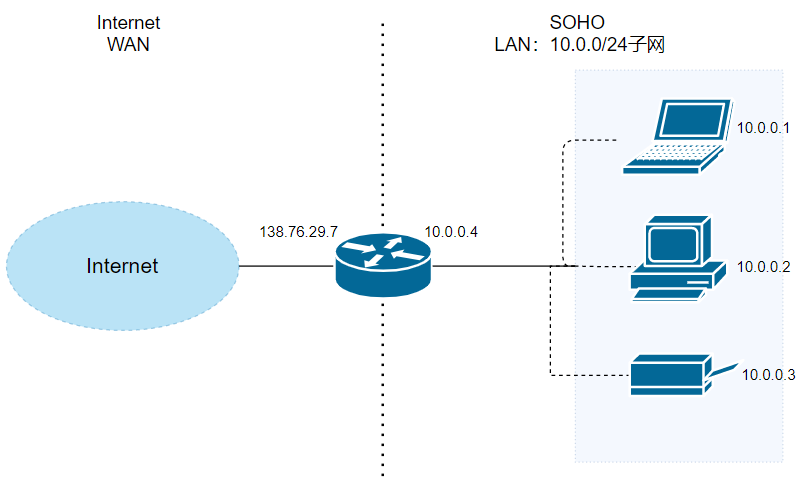

# 第4章 网络层：数据平面

# 下述内容来自javaguide 书本有空再看

1. **IP协议的作用**：IP协议属于网络层，定义数据包的格式，**对数据包进行路由和寻址**，让它们能跨网络传播并到达正确的目的地。  

2. IP地址过滤 IP Address Filetering，限制特性IP地址或IP地址范围的访问。
3. IPV4是32位地址（123.89.46.72），IPV6是128位地址（2001:0db8:85a3:0000:0000:8a2e:0370:7334）。
4. **DHCP，dynamic host configuration protocol 动态主机配置协议，是网络层的协议，用于给主机自动分配IP地址**，让网络管理员能集中管理网络上的IP地址分配、简化网络配置和维护工作。工作原理：

   （1）主机发送一个广播消息（主机目前没有自己的ip，不能向特定设备发消息），寻找可用的DHCP服务器；

   （2）DHCP服务器收到后响应一个提供消息Offer message，提供一个IP地址给主机；

   （3）主机发送request，请求使用该IP地址；

   （4）DHCP服务器ACK确认，分配IP地址给主机，并提供子网掩码、默认网关、DNS服务器等配置信息。
1. IPSec通过加密和认证机制保护数据传输，可以在两种模式下工作：

   （1）传统模式Transport mode，IPSec仅加密payload数据部分，不保护IP header部分，所以IP头部还是明文传输的，适用于两个支持IPSec的主机之间的通信；

   （2）**隧道模式**，整个IP数据包（头部和payload）都被加密封装在一个新的IP数据包中，**适用于网关通信如VPN**。

2. IPV6和IPV4的区别：

   (1). IPV4是32位地址（123.89.46.72），IPV6是128位地址（2001:0db8:85a3:0000:0000:8a2e:0370:7334）。
  
   (2). IPV4要手动配置或使用**动态主机配置协议（DHCP）**进行地址分配；IPV6是无状态地址**自动配置**（stateless address autoconfiguration，SLAAC），主机可以直接通过根据接口标志和网络前缀自动分配地址。
  
   (3). IPV4的header的长度可变，**IPV6**的header固定在40字节，取消了一些字段，**简化了报头结构，提高处理效率**。
  
   (4). **IPV6有更高的安全性**，支持内置的IPsec和加密传输。
  
3. 如何获取客户端真实的IP？

   （1）对于HTTP请求和SMTP请求，服务器可以通过请求头中的 X-Forwarded-For字段获取客户端的真实IP地址。这个字段是由客户端的直接上游设备添加的，但是如果经过了多个代理服务器，这个字段会附带整个请求链中的所有代理服务器IP地址。

   （2）使用TCP时，TCP头部的选项字段（TCP Options），发送端和客户端可以约定好在这个字段里传真实的IP地址。

   （3）客户端如果和服务器是直接连接的，服务器可以通过套接字socket接口直接获取客户端的IP地址。
1. **NAT，network address translation，网络地址转换**。主要用于在不同网络之间转换IP地址。允许将局域网的私有地址映射为公有IP地址，也可以反向**映射**==》**实现局域网中的多个设备通过单一的公有IP地址访问互联网==》缓解IPV4地址资源短缺问题、隐藏局域网内部网络结构，更安全。**

如家里的路由器，就是子网的“代理人”。路由器的LAN，local area network局域网接口管理局域网的私有地址，WAN，wide area network广域网接口负责链接外部网络。**路由器内部运行着一个DHCP服务器，用于给局域网设备分配局域网IP地址**。路由器本身在WAN中的IP地址是138.76.29.7。在局域网设备发送请求时，经过路由器，路由器通过随机分配端口号来映射成共有地址即138.76.29.7+端口号。

